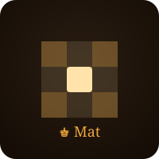

<div align="center">



<br/>


**Klub catur vintage kayu dengan AI sungguhan, multiplayer real-time, dan mode penonton.**
Developer: **Nicholas.ofc**

</div>

---

<div align="center">
  
</div>

<br/>

Royal64 adalah platform catur premium bertema kayu tua klasik — main lawan
teman secara real-time, tantang Royal64 AI, atau tonton pertandingan orang
lain. Dibangun dengan Next.js, TypeScript, Tailwind CSS, dan chess.js.
**Seluruh antarmuka aplikasi berbahasa Indonesia.**

## Daftar Isi

- [Fitur Unggulan](#fitur-unggulan)
- [Apa yang Nyata vs. Apa yang Jujur Masih Placeholder](#apa-yang-nyata-vs-apa-yang-jujur-masih-placeholder)
- [Mulai Cepat](#mulai-cepat)
- [Environment Variables](#environment-variables)
- [Deploy ke Vercel](#deploy-ke-vercel)
- [Struktur Proyek](#struktur-proyek)
- [Catatan Keamanan](#catatan-keamanan)
- [Dukungan Browser](#dukungan-browser)
- [Troubleshooting](#troubleshooting)

---

## Fitur Unggulan

<table>
<tr>
<td align="center" width="25%">
  
  <br/><b>Royal64 AI</b>
  <br/><sub>Minimax + alpha-beta sungguhan, 3 tingkat kesulitan</sub>
</td>
<td align="center" width="25%">
  
  <br/><b>Multiplayer Real-time</b>
  <br/><sub>Room, QR code, ruang tunggu dengan persetujuan host</sub>
</td>
<td align="center" width="25%">
  
  <br/><b>Mode Puzzle</b>
  <br/><sub>Posisi taktik yang diverifikasi manual, bukan asal comot</sub>
</td>
<td align="center" width="25%">
  
  <br/><b>Progressive Web App</b>
  <br/><sub>Bisa dipasang ke layar utama, jalan offline sebagian</sub>
</td>
</tr>
</table>

Fitur lain: pilih warna bidak & batas waktu sebelum membuat ruang, obrolan
dalam pertandingan, mode penonton, nameplate dengan font kustom, efek suara
sintesis untuk tiap jenis langkah, dan sistem menyerah/tawaran seri yang
benar-benar berfungsi dua arah.

---

## Apa yang Nyata vs. Apa yang Jujur Masih Placeholder

Proyek ini dibangun untuk benar-benar bisa dimainkan dari ujung ke ujung,
tapi beberapa bagian sengaja dibiarkan sebagai *seam* yang jujur diberi
label dan mudah diganti, bukan dipalsukan:

| Fitur | Status |
|---|---|
| Aturan catur (skak, skakmat, rokade, en passant, promosi, seri) | **Sepenuhnya nyata**, via `chess.js` |
| Lawan komputer | **Pencarian minimax/alpha-beta sungguhan** dengan evaluasi materi + posisi + move ordering, 3 tingkat kesulitan yang genuinely berbeda kekuatan (bukan sekadar noise acak). Diberi label "Royal64 AI" — bukan Stockfish. Lihat `lib/chess/computer.ts` untuk interface `ComputerOpponent` kalau mau pasang Stockfish WASM asli nanti. |
| Lokal 2 pemain | **Sepenuhnya nyata** |
| Room multiplayer, Game ID, kode QR, share | **Sepenuhnya nyata** — ID dibuat dinamis, QR meng-encode URL join asli, share pakai Web Share API dengan fallback salin |
| Setup ruang (pilih warna + batas waktu sebelum buat room) | **Sepenuhnya nyata** — host pilih Putih/Hitam/Acak dan batas waktu; warna & waktu joiner dikonfirmasi otomatis oleh host saat approve, jadi tetap benar walau seseorang gabung dengan mengetik Game ID manual |
| Ruang tunggu / alur persetujuan | **Sepenuhnya nyata** — host melihat permintaan gabung dengan tombol Ya/Tidak; kedua layar pindah ke papan pada broadcast yang sama persis |
| Sinkronisasi langkah real-time | **Implementasi Supabase Realtime asli**, aktif begitu `NEXT_PUBLIC_SUPABASE_URL` / `NEXT_PUBLIC_SUPABASE_ANON_KEY` diisi. Tanpa itu, aplikasi **jujur menampilkan "belum dikonfigurasi"**, bukan pura-pura tersambung — lihat `lib/realtime/provider.ts` |
| PWA (manifest, service worker, install prompt) | **Sepenuhnya nyata** — pakai event `beforeinstallprompt` asli |
| Nama pemain (wajib isi di kunjungan pertama + ganti nama) | **Sepenuhnya nyata**, tersimpan di `localStorage` per browser |
| Nameplate di papan | **Sepenuhnya nyata** — ditukar langsung antar pemain lewat channel realtime yang sama dengan langkah |
| Obrolan dalam pertandingan | **Sepenuhnya nyata** — broadcast real-time di channel Supabase yang sama dengan langkah |
| Mode penonton | **Sepenuhnya nyata** — masuk Game ID mana pun lewat "Tonton Pertandingan" untuk mengikuti channel room secara read-only |
| Menyerah & tawaran seri | **Sepenuhnya nyata dan dua arah** — broadcast ke lawan, papan otomatis terkunci begitu game berakhir dengan cara apa pun |
| Suara langkah/makan/skak/game selesai | **Disintesis saat runtime** dengan Web Audio API (lihat catatan kejujuran di bawah) — bukan rekaman audio |
| Font kustom (Leander untuk nama, Wood Chaos untuk judul) | **Sepenuhnya nyata**, di-hosting sendiri via `@font-face` — lihat catatan lisensi font di bawah |
| Ikon aplikasi/PWA | Dibuat dari gambar lambang yang disediakan pengguna (`icon-192.png`, `icon-512.png`, `icon-maskable.png`, `favicon.ico`) |

> **Dihapus:** fitur ganti tema terang/gelap yang sempat ada sudah dicabut
> total — sekarang tetap satu tema kayu vintage gelap.

<details>
<summary><b>Catatan kejujuran — efek suara</b></summary>

<br/>

`lib/audio/sfx.ts` menghasilkan nada perkusi pendek pakai oscillator + noise
buffer terfilter untuk mendekati suara "kayu beradu kayu". Sandbox
pengembangan ini tidak punya akses internet untuk mengambil sample audio
asli, jadi tidak ada satu pun suara di sini yang berasal dari rekaman set
catur sungguhan. Mengganti dengan rekaman asli nanti tinggal tempel —
ganti panggilan `playTone(...)`/`playKnock(...)` di file itu dengan
pemutaran `<audio>` file `.mp3`/`.wav` milikmu sendiri.

</details>

<details>
<summary><b>Catatan lisensi font</b></summary>

<br/>

- **Leander** (dipakai untuk nama pemain): gratis untuk pemakaian personal
  *maupun* komersial, termasuk embed web, sesuai file lisensi yang
  disertakan.
- **Wood Chaos** (dipakai untuk judul, oleh Woodcutter Manero): font dari
  foundry ini umumnya didistribusikan sebagai **gratis untuk pemakaian
  personal saja** — pemakaian komersial biasanya perlu menghubungi
  foundry-nya langsung. Font ini di-embed di proyek karena memang
  disediakan langsung untuk build ini; kalau berencana merilis Royal64
  secara komersial, konfirmasi dulu lisensinya ke Woodcutter Manero.

</details>

---

## Mulai Cepat

```bash
npm install
npm run dev
```

Buka `http://localhost:3000` — otomatis diarahkan ke `/dashboard`.

<table>
<tr>
<td>

**Build produksi**
```bash
npm run build
npm start
```

</td>
<td>

**Menjalankan tes**
```bash
npm run test
```

</td>
</tr>
</table>

Tes mencakup aturan catur inti (langkah legal/ilegal, deteksi skakmat,
rokade, en passant, promosi), pembuatan Game ID, parsing batas waktu, serta
perilaku AI (menghindari pengulangan posisi, menangkap bidak gratis).

---

## Environment Variables

Salin `.env.example` ke `.env.local`:

```bash
cp .env.example .env.local
```

| Variabel | Wajib? | Kegunaan |
|---|---|---|
| `NEXT_PUBLIC_SUPABASE_URL` | Opsional | Mengaktifkan sinkronisasi multiplayer lintas perangkat |
| `NEXT_PUBLIC_SUPABASE_ANON_KEY` | Opsional | Mengaktifkan sinkronisasi multiplayer lintas perangkat |
| `NEXT_PUBLIC_APP_URL` | Opsional | Dipakai untuk membangun URL join absolut pada kode QR |

Royal64 tetap berjalan penuh tanpa env var apa pun — room, QR, dan ruang
tunggu tetap berfungsi, tapi sinkronisasi langkah akan menampilkan
"Realtime belum dikonfigurasi" alih-alih pura-pura tersambung.

`@supabase/supabase-js` sudah terdaftar sebagai dependency (supaya build
tetap sukses sebelum dikonfigurasi) — dia diam saja sampai dua env var di
atas diisi.

Cara mengaktifkan multiplayer sungguhan:
1. Buat project gratis di [supabase.com](https://supabase.com)
2. Aktifkan Realtime di project tersebut
3. Isi dua env var di atas

---

## Deploy ke Vercel

```bash
vercel
```

Atau import repository langsung lewat dashboard Vercel. Tidak perlu
konfigurasi khusus di luar env var opsional di atas — ini project Next.js
App Router standar.

---

## Struktur Proyek

```text
Royal64/
├── .github/assets/       # Banner & ikon animasi untuk README ini
├── app/                  # Next.js App Router routes
│   ├── dashboard/        # Lobi digital premium (layar pertama)
│   ├── game/             # Portal Permainan + ruang [gameId] + error boundary
│   ├── offline/          # Halaman fallback offline (service worker)
│   ├── layout.tsx        # Font, metadata, registrasi PWA
│   ├── error.tsx         # Error boundary utama
│   └── not-found.tsx     # Halaman 404 kustom
├── components/
│   ├── chess/            # Papan, bidak, petak, jam, kontrol, modal, lobi
│   ├── dashboard/        # Hero, aksi cepat, navigasi, kartu fitur
│   ├── pwa/              # Tombol install, registrasi service worker
│   └── ui/               # Notifikasi toast (tanpa alert() browser)
├── lib/
│   ├── chess/            # Wrapper engine, AI, layanan komputer, Game ID
│   ├── realtime/         # Abstraksi provider realtime + implementasi Supabase
│   └── store/            # Zustand store status permainan & pemain
├── public/
│   ├── icons/            # Ikon PWA (dari gambar lambang pengguna)
│   ├── fonts/            # Leander.ttf, WoodChaos.otf (self-hosted)
│   ├── textures/         # Tekstur SVG kayu dipakai di seluruh UI
│   ├── manifest.webmanifest
│   └── sw.js             # Service worker (strategi cache + offline)
├── tests/                # Tes unit Vitest untuk aturan catur & AI
├── .env.example
└── README.md
```

---

## Catatan Keamanan

- Tidak ada secret yang di-hardcode di source; kredensial Supabase hanya
  dibaca dari environment variables.
- Game ID dibuat dengan `crypto.getRandomValues` dan divalidasi dengan
  regex ketat sebelum pencarian room mana pun.
- Semua langkah multiplayer divalidasi ulang oleh engine catur lokal
  sebelum diterapkan — payload jaringan yang jahat/rusak tidak bisa
  memaksakan posisi papan ilegal di sisi client. (Backend produksi
  sebaiknya juga memvalidasi langkah di server sebelum broadcast.)
- `.env.local` dan `.env` di-gitignore; hanya `.env.example` (tanpa nilai
  asli) yang di-commit.

## Dukungan Browser

Menyasar Chrome, Edge, Firefox, Safari versi terkini dan versi mobile-nya.
Fitur yang tidak didukung luas (mis. `navigator.share`,
`beforeinstallprompt`) otomatis fallback ke salin-clipboard dan instruksi
install manual.

## Troubleshooting

<details>
<summary>Tombol install bilang "tidak tersedia"</summary>
<br/>

`beforeinstallprompt` tidak dipicu oleh Safari/iOS atau browser yang belum
memenuhi kriteria PWA (HTTPS + manifest valid + service worker
terdaftar). Gunakan "Tambahkan ke Layar Utama" secara manual di iOS.
</details>

<details>
<summary>Multiplayer menampilkan "belum dikonfigurasi"</summary>
<br/>

Lihat langkah setup Supabase di atas — ini memang fallback jujur yang
disengaja, bukan bug.
</details>

<details>
<summary>Error path alias TypeScript</summary>
<br/>

Pastikan `paths` (`@/*`) di `tsconfig.json` cocok dengan versi TS server
editor-mu.
</details>

---

<div align="center">


**Royal64** — Setiap Langkah Menjadi Sejarah.

Developer: **Nicholas.ofc**

</div>
